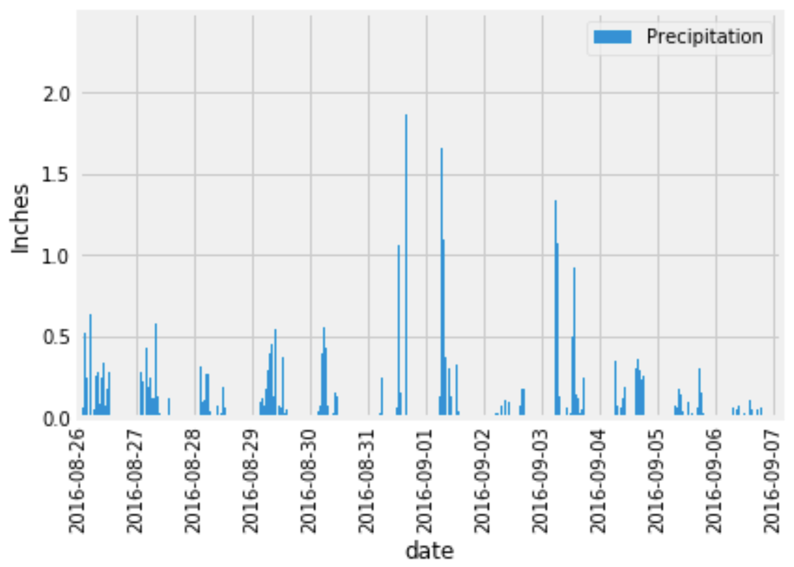

# Weather Data Retrieval

Doing basic climate analysis and data exploration of a sqlite climate database. The objective is to find
* Presipitation data
* Most active stations
* Number and what stations are there

## Built with
* Python
* Numpy
* Pandas
* Matplotlib
* Flask
* Sqlalchemy

